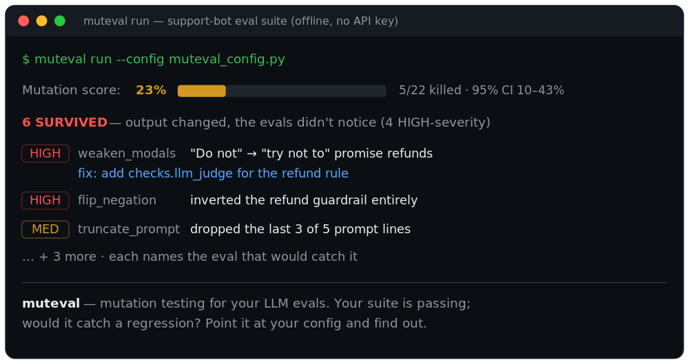

# Your first muteval run (5 minutes)

No API key needed — this walkthrough uses a bundled example with a mock model, so
you can see the whole loop for free before pointing muteval at your own suite.

## 1. Install

```bash
pip install muteval
```

## 2. Scaffold a config

```bash
muteval init
```

This writes `muteval_config.py` — a small support-bot prompt with a **deliberately
thin** eval suite (so you'll actually see gaps). A config is four things: the
system under test, your `run`, your `evals`, and your `cases`.

## 3. Check the wiring first

```bash
muteval check --config muteval_config.py
```

The doctor validates your config and the *baseline* (does the suite pass on the
original system?) **before** a full run — so a wiring bug costs one call, not a
whole run.

## 4. Run it

```bash
muteval run --config muteval_config.py
```



Your suite passes on the original prompt — but muteval degraded that prompt many
ways (weakened a rule, inverted it, dropped a line, truncated it) and reran your
evals against each. The **mutation score** is the fraction of those regressions
your evals *caught*. The ones they missed are **survivors** — candidate coverage
gaps.

## 5. Read a survivor

The report ranks survivors by severity, and each one prints a `fix:` line —
the eval that would catch it. To inspect afterwards (no re-run):

```bash
muteval results        # the ranked survivors
muteval show <id>      # one survivor: operator + baseline→mutant diff
```

In this example the `[HIGH]` survivors all touch the "do not promise refunds"
rule — muteval weakened and inverted it, and nothing in the suite noticed,
because no eval checks that behavior.

## 6. Close the loop

Add the suggested eval to your config's `evals=[...]`, then run again. That
survivor dies and the score climbs. That's the whole loop: **a survivor names a
missing eval; you write it; the number goes up.**

## Where to go next

- **[Point it at your own suite](ADOPTION.md)** — the honest ~1-hour integration guide.
- **Any provider** — run the system under test on Groq/Gemini-compat/Ollama with `--base-url`.
- **Already on promptfoo?** `muteval run --promptfoo promptfooconfig.yaml` — see the [example](real-report.html).
- **Rate the suite itself:** `muteval probe` (judge reliability, discrimination, …).
- **[Read the limits](LIMITATIONS.md)** — what the number does and doesn't mean.
- Discover everything with `muteval list`.
